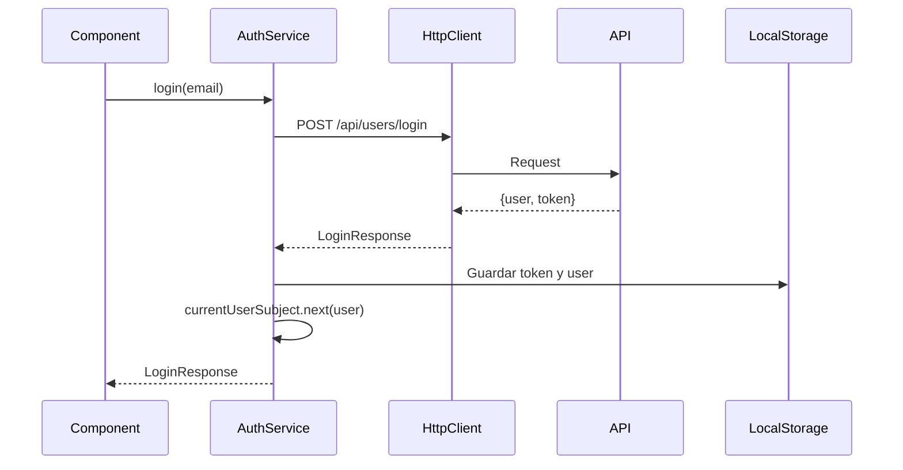

# Módulo Core

El módulo Core contiene los servicios, guards e interceptors fundamentales de la aplicación que son singleton y se utilizan en toda la aplicación.

## Estructura

```
core/
├── services/           # Servicios globales
│   ├── auth.service.ts
│   └── index.ts
├── guards/            # Route guards
│   ├── auth.guard.ts
│   └── index.ts
├── interceptors/      # HTTP interceptors
│   ├── auth.interceptor.ts
│   └── index.ts
└── README.md
```

## Servicios

### AuthService

Servicio de autenticación que gestiona el estado del usuario y las operaciones de login/logout.

**Características:**
- Gestión de estado reactiva con `BehaviorSubject`
- Almacenamiento persistente en `localStorage`
- Observable del usuario actual (`currentUser$`)
- Métodos de autenticación y verificación

**Uso básico:**

```typescript
import { AuthService } from './core/services/auth.service';

constructor(private authService: AuthService) {}

// Login
this.authService.login('user@example.com').subscribe({
  next: (response) => {
    console.log('Usuario autenticado:', response.user);
  },
  error: (error) => {
    console.error('Error de login:', error);
  }
});

// Verificar autenticación
const isAuth = this.authService.isAuthenticated();

// Obtener usuario actual
const user = this.authService.getCurrentUser();

// Escuchar cambios en el usuario
this.authService.currentUser$.subscribe(user => {
  console.log('Usuario actual:', user);
});

// Logout
this.authService.logout();
```

**API:**

| Método | Descripción | Retorno |
|--------|-------------|---------|
| `login(email: string)` | Autentica un usuario | `Observable<LoginResponse>` |
| `logout()` | Cierra la sesión | `void` |
| `isAuthenticated()` | Verifica si hay sesión activa | `boolean` |
| `getCurrentUser()` | Obtiene el usuario actual | `User \| null` |
| `getToken()` | Obtiene el token JWT | `string \| null` |
| `currentUser$` | Observable del usuario | `Observable<User \| null>` |

## Guards

### authGuard

Guard funcional que protege rutas que requieren autenticación.

**Uso:**

```typescript
import { authGuard } from './core/guards/auth.guard';

export const routes: Routes = [
  {
    path: 'tasks',
    component: TasksComponent,
    canActivate: [authGuard]  // Ruta protegida
  }
];
```

**Comportamiento:**
- Si el usuario está autenticado → permite el acceso
- Si el usuario NO está autenticado → redirige a `/login` con `returnUrl`

## Interceptors

### authInterceptor

Interceptor HTTP funcional que agrega automáticamente el token JWT a todas las peticiones.

**Configuración en `app.config.ts`:**

```typescript
import { authInterceptor } from './core/interceptors/auth.interceptor';

export const appConfig: ApplicationConfig = {
  providers: [
    provideHttpClient(withInterceptors([authInterceptor]))
  ]
};
```

**Funcionamiento:**
1. Intercepta todas las peticiones HTTP salientes
2. Obtiene el token JWT del `AuthService`
3. Si existe token, agrega header `Authorization: Bearer <token>`
4. Continúa con la petición

## Principios de Diseño

### Single Responsibility Principle (SRP)
Cada servicio tiene una única responsabilidad:
- `AuthService` → gestión de autenticación
- `authGuard` → protección de rutas
- `authInterceptor` → inyección de tokens

### Dependency Injection
Todos los servicios usan el decorador `@Injectable({ providedIn: 'root' })` para ser singleton y disponibles en toda la aplicación.

### Reactive Programming
Uso de RxJS Observables para:
- Estado reactivo con `BehaviorSubject`
- Operadores como `tap`, `catchError` para manejo de efectos secundarios
- Propagación automática de cambios a todos los suscriptores

## Testing

Todos los servicios y guards incluyen pruebas unitarias completas:

- `auth.service.spec.ts` - Tests del AuthService
- `auth.guard.spec.ts` - Tests del authGuard

**Ejecutar tests:**

```bash
npm test
```

## Mejores Prácticas

1. **No modificar el módulo Core directamente** - Este módulo debe ser estable
2. **Servicios singleton** - Los servicios Core siempre usan `providedIn: 'root'`
3. **No importar feature modules** - Core no debe depender de features
4. **Inmutabilidad** - Siempre crear nuevas instancias al actualizar estado
5. **Manejo de errores** - Siempre usar `catchError` en Observables

## Flujo de Autenticación



## Seguridad

### Almacenamiento del Token
- El token JWT se almacena en `localStorage` con la clave `auth_token`
- Se agrega automáticamente a todas las peticiones HTTP
- Se elimina al hacer logout

### Protección de Rutas
- El `authGuard` verifica autenticación antes de activar rutas
- Redirige a login con `returnUrl` para volver después de autenticar
- Valida tanto la existencia del usuario como del token

## Dependencias

- `@angular/core` - Framework base
- `@angular/common/http` - Cliente HTTP
- `@angular/router` - Routing
- `rxjs` - Programación reactiva

## Notas de Implementación

### Angular 17+ Standalone
Este módulo está diseñado para trabajar con la arquitectura standalone de Angular 17+:
- No hay módulos NgModule
- Guards e interceptors son funcionales (no basados en clases)
- Uso de `inject()` en lugar de inyección por constructor en guards/interceptors

### localStorage vs sessionStorage
Se usa `localStorage` para persistir la sesión entre pestañas y recargas. Si se prefiere sesiones por pestaña, cambiar a `sessionStorage`.
